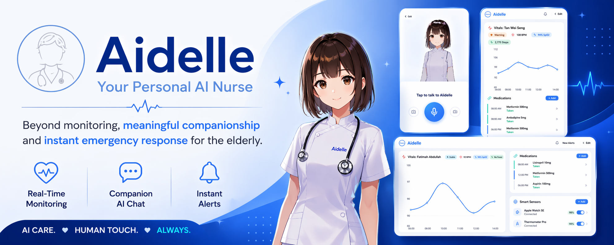
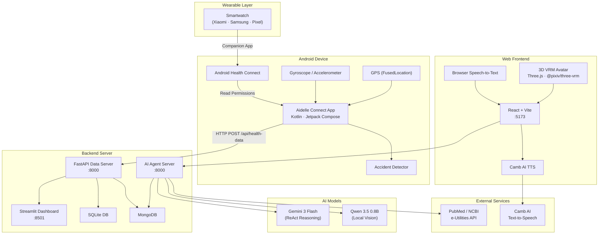

# Aidelle : Your Personal AI Nurse



**Aidelle** is a full-stack, AI-powered health monitoring ecosystem designed to care for elderly users. It combines a **React + Three.js** web frontend with a 3D AI avatar, an **Android (Jetpack Compose)** mobile client, a **Python FastAPI** data-sync backend, and a **LangGraph-powered AI Agent** backend into one cohesive platform. The mobile app reads biometrics from smartwatches via Android **Health Connect**, syncs readings to a local server, and the AI agent provides conversational medical assistance — including injury vision analysis, medication reminders, PubMed research, anomaly detection, fall/accident detection, and emergency contact alerting.

---

## Architecture Overview



### System Components

| # | Component | Tech Stack | Purpose |
|---|-----------|------------|---------|
| 1 | **Aidelle Frontend** (Web App) | React 19, Vite 8, Three.js, @pixiv/three-vrm, Camb AI TTS, Recharts, React Router | Interactive 3D AI nurse avatar with voice conversation, video injury analysis, and a nurse monitoring dashboard |
| 2 | **Aidelle Connect** (Android App) | Kotlin 2.0, Jetpack Compose, Health Connect 1.1, Retrofit 2, WorkManager, DataStore | Reads wearable biometrics via Health Connect, device gyroscope/GPS, detects falls, and syncs data to the backend every 15 min |
| 3 | **FastAPI Data Backend** | Python, FastAPI, SQLite, MongoDB, Pydantic v2 | RESTful API that ingests, stores, and serves time-series health records |
| 4 | **AI Agent Backend** | Python, LangGraph (ReAct), Gemini 3 Flash, Qwen 3.5 0.8B (local), LangChain | Conversational medical assistant with tool-calling: vision injury analysis, PubMed search, medication reminders, sensor anomaly detection, emergency alerting |
| 5 | **Streamlit Dashboard** | Streamlit, Plotly, Pandas | Live health visualization with configurable alert thresholds and a Vital Stability Score |

---

## Web Frontend (Aidelle Frontend)

The web frontend is a **React 19 + Vite** application with two primary views:

### Patient View (`/user`)
A full-screen, accessible interface featuring:
- **3D VRM Avatar** — A lifelike AI nurse rendered with `@pixiv/three-vrm` and `@react-three/fiber` (Three.js). Supports idle, waving, talking, thinking, and nodding animations via `.vrma` clips with smooth crossfade transitions.
- **Voice Conversation** — Browser-native Speech-to-Text (Web Speech API) for input, and **Camb AI** cloud TTS (`mars-flash` model) for natural-sounding spoken responses.
- **Procedural Lip Sync** — Dual-wave sinusoidal mouth animation driving VRM expression blend shapes (`aa`, `ih`, `ou`) synchronized with audio playback.
- **Video Injury Analysis** — Record video via `MediaRecorder`, upload to the Agent Backend `/analyze-video` endpoint, and receive spoken analysis.
- **Conversation History** — Scrollable overlay showing timestamped user/AI message pairs.
- **Real-Time Subtitles** — Word-by-word subtitle reveal synced to TTS speaking pace, with auto-fade after silence.

### Nurse Dashboard (`/nurse`)
A comprehensive monitoring panel for caregivers:
- **Patient Overview Cards** — Click to select from tracked residents (Stable / Warning / Critical status indicators).
- **Heart Rate Chart** — Interactive `Recharts` line chart with gradient stroke per patient.
- **Medication Management** — Per-patient drug schedule with add/remove, status tracking (taken, upcoming, missed, scheduled).
- **Smart Sensor Management** — Per-patient device inventory (smartwatch, temperature, insulin pump, GPS, sleep monitor) with battery levels, on/off toggles, and add/remove.
- **Live Data Polling** — Fetches latest health records from the FastAPI backend every 5 seconds.

### Frontend Environment Variables
```env
VITE_AGENT_API_URL=http://localhost:8000   # Agent Backend URL
VITE_DATA_API_URL=http://localhost:8000     # FastAPI Data Backend URL
VITE_CAMB_API_KEY=your_camb_api_key        # Camb AI TTS API key
```

---

## Supported Health Metrics

Aidelle supports modular smart health monitoring including:

| Metric | Unit | Icon | Source |
|--------|------|------|--------|
| Heart Rate | `bpm` | ❤️ | Health Connect (`HeartRateRecord`) |
| Steps | `steps` | 👣 | Health Connect (`StepsRecord`) |
| Blood Oxygen / SpO2 | `%` | 🩸 | Health Connect (`OxygenSaturationRecord`) |
| Sleep Duration | `minutes` | 🛏️ | Health Connect (`SleepSessionRecord`) |
| Body Temperature | `°C` | 🌡️ | Health Connect (`BodyTemperatureRecord`) |
| Accelerometer | `m/s²` | 📐 | Device Sensor (`SensorManager`) |
| Gyroscope | `rad/s` | 📐 | Device Sensor (`SensorManager`) |
| GPS Location | `m/s` | 📍 | FusedLocationProviderClient |
| Accident Alert | `m/s²` | 🚨 | AccidentDetector (fall detection) |

---

## AI Agent Capabilities

The Agent Backend uses a **dual-LLM architecture**:

- **Gemini 3 Flash** (cloud, via Google AI API) — Primary reasoning brain; handles the ReAct loop and tool orchestration.
- **Qwen 3.5 0.8B** (local, via HuggingFace Transformers) — Dedicated vision model for analyzing injury images and videos on-device.

### Agent Toolkit

| Tool | Description |
|------|-------------|
| `search_medical_database` | Queries **PubMed** (NCBI e-Utilities) for peer-reviewed medical articles and summarizes results in plain language |
| `check_patient_reminders` | Checks a MongoDB/mock medication database for overdue doses based on scheduling rules |
| `call_emergency_contact` | Sends an emergency alert message to the configured caretaker email |
| `analyze_injury_image_file` | Uses Qwen Vision to analyze a photo of an injury and provide first-aid assessment |
| `analyze_injury_video_file` | Uses Qwen Vision to analyze a video of an injury and provide first-aid assessment |
| `get_and_analyze_sensor_data` | Fetches daily sensor arrays (HR, BP, SpO2, temperature) and detects anomalies against clinical thresholds |

### Agent API Endpoints

| Method | Endpoint | Description |
|--------|----------|-------------|
| `GET` | `/health` | Agent health check |
| `POST` | `/chat` | Send a natural-language message; the agent reasons, calls tools, and replies |
| `POST` | `/analyze-video` | Upload a video file for direct injury analysis (supports WebM → MP4 conversion) |
| `POST` | `/analyze-image` | Upload an image file for direct injury analysis |

---

## Accident / Fall Detection

The Android app includes a **3-phase fall detection algorithm** (`AccidentDetector.kt`):

1. **Impact Phase** — Accelerometer magnitude exceeds **30 m/s²** (≈3g), triggering a monitoring window.
2. **Rotation Phase** — Gyroscope magnitude exceeds **5 rad/s** during the impact, indicating a tumble.
3. **Stillness Phase** — Post-impact low acceleration variance for 3+ seconds, suggesting the user is motionless after a fall.

Confidence levels:
- **High** — Both stillness and high rotation detected
- **Medium** — One of the two conditions met
- **Low** — Dismissed (no alert)

Alerts are immediately sent to the backend with GPS coordinates, peak acceleration, and confidence metadata. A 30-second cooldown prevents duplicate alerts.

---

## Project Structure

```
Aidelle/
├── README.md
├── .gitignore
├── .env                                     # API keys (not committed)
├── assets/
│   └── banner.jpg
│
├── aidelle-frontend/                        # Web Frontend (React + Vite)
│   ├── package.json                         # React 19, Three.js, Recharts, Camb AI
│   ├── vite.config.js
│   ├── index.html
│   ├── public/
│   │   ├── assistant.vrm                    # 3D VRM avatar model
│   │   ├── animation/                       # VRMA animation clips
│   │   │   ├── Idle.vrma
│   │   │   ├── Talking.vrma
│   │   │   ├── Thinking.vrma
│   │   │   ├── Waving.vrma
│   │   │   └── Head Nod Yes.vrma
│   │   ├── icon.jpeg
│   │   └── favicon.svg
│   └── src/
│       ├── main.jsx                         # React entry point
│       ├── App.jsx                          # Router: /, /user, /nurse
│       ├── components/
│       │   └── Avatar.jsx                   # 3D VRM avatar with lip sync
│       ├── hooks/
│       │   ├── useBrain.js                  # Agent API integration
│       │   ├── useVoice.js                  # STT + Camb AI TTS
│       │   └── useAudioAnalyzer.js          # WebAudio frequency analysis
│       ├── utils/
│       │   └── loadMixamoAnimation.js       # Mixamo → VRM retargeting
│       └── views/
│           ├── HomeSelection.jsx            # Landing page (role selector)
│           ├── UserMobileView.jsx           # Elderly voice + avatar interface
│           ├── UserMobileView.css
│           ├── NurseDashboard.jsx           # Nurse monitoring panel
│           ├── NurseDashboard.css
│           └── HomeSelection.css
│
├── Aidelle_Connect_app/                     # Android Mobile App
│   ├── build.gradle.kts                     # Root Gradle (AGP 8.7, Kotlin 2.0.21)
│   ├── settings.gradle.kts
│   └── app/
│       ├── build.gradle.kts                 # App-level dependencies
│       └── src/main/
│           ├── AndroidManifest.xml
│           └── java/com/aidelle/sensorread/
│               ├── MainActivity.kt          # Entry point, permission launchers
│               ├── data/
│               │   ├── HealthConnectManager.kt  # Health Connect SDK wrapper
│               │   ├── SensorDataManager.kt     # Gyroscope + Accelerometer
│               │   ├── LocationDataManager.kt   # GPS via FusedLocation
│               │   ├── AccidentDetector.kt      # Fall detection algorithm
│               │   ├── SensorPreferences.kt     # DataStore sensor toggles
│               │   ├── api/
│               │   │   ├── ApiService.kt        # Retrofit interface
│               │   │   └── RetrofitClient.kt    # Configurable HTTP client
│               │   └── model/
│               │       └── HealthData.kt        # DTOs matching FastAPI schemas
│               ├── viewmodel/
│               │   └── HealthViewModel.kt       # MVVM state + sync logic
│               ├── worker/
│               │   └── HealthSyncWorker.kt      # WorkManager background sync
│               └── ui/
│                   ├── screens/
│                   │   └── HomeScreen.kt        # Main dashboard + sensor toggles
│                   ├── components/
│                   │   └── HealthDataCard.kt    # Card + summary composables
│                   └── theme/
│                       ├── Color.kt
│                       ├── Theme.kt
│                       └── Type.kt
│
├── fastapi_backend/                         # Data Sync Backend
│   ├── README.md
│   ├── requirements.txt
│   ├── main.py                              # FastAPI app, CORS, routes
│   ├── models.py                            # Pydantic schemas + DataType enum
│   ├── database.py                          # SQLite CRUD layer
│   ├── mongodb.py                           # MongoDB drop-in replacement
│   ├── health_data.db                       # SQLite database file
│   └── dashboard.py                         # Streamlit health dashboard
│
└── Agent_Backend/                           # AI Agent Backend
    ├── api.py                               # FastAPI app with /chat, /analyze-*
    ├── medical_agent.py                     # CLI-based interactive agent
    ├── gemini_model.py                      # Gemini 3 Flash LangChain wrapper
    ├── local_qwen.py                        # Qwen 3.5 0.8B local LLM wrapper
    └── tools.py                             # LangChain tools (6 tools)
```

---

## Project Setup & Installation

### 1. Web Frontend (Aidelle Frontend)

```bash
cd aidelle-frontend/

# Create .env with API keys:
# VITE_AGENT_API_URL=http://localhost:8000
# VITE_DATA_API_URL=http://localhost:8000
# VITE_CAMB_API_KEY=your_camb_api_key

npm install
npm run dev
```

*Opens at `http://localhost:5173`. Navigate to `/user` for the AI avatar or `/nurse` for the monitoring dashboard.*

### 2. FastAPI Data Backend

```bash
cd fastapi_backend/
python -m venv venv

# Windows:
.\venv\Scripts\activate
# Unix/macOS:
source venv/bin/activate

pip install -r requirements.txt
uvicorn main:app --host 0.0.0.0 --port 8000 --reload
```

*API at `http://localhost:8000` — Swagger UI at `/docs`.*

### 3. Streamlit Dashboard

```bash
cd fastapi_backend/
streamlit run dashboard.py
```

*Opens automatically at `http://localhost:8501`.*

### 4. AI Agent Backend

```bash
cd Agent_Backend/

# Create a .env file with your API key:
echo GEMINI_API_KEY=your_key_here > .env

# Install dependencies (LangGraph, LangChain, Transformers, PyTorch, etc.)
pip install langchain langgraph langchain-google-genai transformers torch opencv-python pymongo python-dotenv qwen-vl-utils fastapi uvicorn

# Run as API server:
uvicorn api:app --host 0.0.0.0 --port 8000

# Or run as interactive CLI:
python medical_agent.py --model gemini
```

### 5. Android App (Aidelle Connect)

1. Open `Aidelle_Connect_app/` in **Android Studio** (Ladybug or later).
2. Sync Project with Gradle Files.
3. Build and run on a **Physical Device** or Emulator running **API 28+**.
4. Tap the ⚙️ settings icon to configure your server URL (e.g. `http://192.168.x.x:8000`).
5. Enable/disable individual sensors (Heart Rate, Steps, SpO2, Sleep, Temperature, Gyroscope, GPS, Accident Detection) from the **Sensor Configuration** panel.
6. Grant Health Connect and Location permissions, then tap **Sync Now**.

---

## Data Backend API Documentation

### Entity-Relationship (Database)

The SQLite database `health_data.db` stores the `health_records` table:

| Column Name | Type | Constraints | Description |
| :--- | :--- | :--- | :--- |
| `id` | `INTEGER` | `PRIMARY KEY, AUTOINCREMENT` | Unique record ID |
| `data_type` | `TEXT` | `NOT NULL` | Enumerated string: `heart_rate`, `steps`, `gyroscope`, `gps`, `accident_alert`, etc. |
| `value` | `REAL` | `NOT NULL` | The actual reading (e.g., 98.2) |
| `unit` | `TEXT` | `NOT NULL` | e.g. `bpm`, `%`, `steps`, `m/s²`, `rad/s` |
| `timestamp` | `TEXT` | `NOT NULL` | ISO 8601 start timestamp of the reading |
| `end_timestamp` | `TEXT` | `NULL` | ISO 8601 end time (for durational data like sleep) |
| `metadata` | `TEXT` | `NULL` | JSON-encoded string for extra flags (e.g., x/y/z axes, lat/lng, accident confidence) |
| `device_id` | `TEXT` | `NULL` | Device manufacturer & model identity |
| `created_at` | `TEXT` | `NOT NULL` | Backend insertion timestamp |

> **MongoDB Support:** A drop-in `mongodb.py` module mirrors the SQLite interface. Configure via the `MONGODB_URI` environment variable (defaults to `mongodb://localhost:27017/`, database `aidelle_db`).

### API Endpoints

#### `GET /`
**Health Check Endpoint.**
**Response (`200 OK`)**:
```json
{
  "status": "online",
  "service": "Aidelle Connect API",
  "total_records": 105,
  "timestamp": "2026-04-18T10:00:00"
}
```

#### `POST /api/health-data`
**Batch upload endpoint for pushing records from mobile client to backend.**
**Payload**: `HealthDataBatch`
```json
{
  "device_id": "samsung SM-G991B",
  "records": [
    {
      "data_type": "heart_rate",
      "value": 75.0,
      "unit": "bpm",
      "timestamp": "2026-04-18T08:30:00Z"
    },
    {
      "data_type": "gyroscope",
      "value": 1.23,
      "unit": "rad/s",
      "timestamp": "2026-04-18T08:30:01Z",
      "metadata": {"x": 0.5, "y": 0.8, "z": 0.3}
    },
    {
      "data_type": "accident_alert",
      "value": 35.2,
      "unit": "m/s²",
      "timestamp": "2026-04-18T08:30:02Z",
      "metadata": {
        "accident_detected": true,
        "peak_acceleration": 35.2,
        "confidence": "high",
        "gps_latitude": 3.1234,
        "gps_longitude": 101.5678
      }
    }
  ]
}
```

#### `GET /api/health-data`
**Query all synced health data with optional query filters.**
**Params:**
- `data_type` (Optional): Filter to specific biometric.
- `start_time`, `end_time` (Optional ISO 8601 strings)
- `limit` (Default: 100)

#### `GET /api/health-data/latest`
**Fetches the most recent entry for every unique `data_type`. Perfect for rendering dashboards.**

---

## Streamlit Dashboard Features

The Aidelle Tier 1 dashboard (`dashboard.py`) provides:

- **Real-Time Metric Cards** — Average values per biometric with outlier alerts
- **Time-Series Plots** — Interactive Plotly scatter/line charts per metric, with alert threshold lines
- **Configurable Alert Criteria** — Sidebar sliders for max heart rate, min SpO2, max temperature, step goals, and sleep targets
- **Time Range Filtering** — Last 24 hours, 7 days, 30 days, or all time
- **Vital Stability Score** — A 0–100 composite index penalizing outlier readings
- **Anomaly Log Table** — Chronological incident log of all threshold violations

---

## Tech Stack Summary

| Layer | Technology |
|-------|-----------|
| Web Frontend | React 19, Vite 8, Three.js 0.183, @pixiv/three-vrm 3.5, @react-three/fiber 9, Recharts 3.8, React Router 7, Lucide React |
| Voice & TTS | Browser Web Speech API (STT), Camb AI `mars-flash` (TTS) |
| 3D Avatar | VRM 1.0, VRMA animation clips (Idle, Talking, Thinking, Waving, Nodding), procedural lip sync |
| Mobile | Kotlin 2.0, Jetpack Compose (Material 3), Health Connect 1.1-alpha10, Retrofit 2.11, WorkManager, DataStore Preferences, Play Services Location 21.3 |
| Data Backend | Python, FastAPI 0.115, Pydantic 2.9, SQLite (WAL mode), PyMongo 4.6 |
| AI Agent | LangGraph (ReAct), LangChain, Gemini 3 Flash (Google AI), Qwen 3.5 0.8B (local HuggingFace), OpenCV |
| Dashboard | Streamlit 1.38, Plotly 5.23, Pandas 2.0 |
| External APIs | PubMed NCBI e-Utilities, Camb AI TTS |

---

## Contact and Credits

Developed by **Mokhtar Ouardi**, **Adam Aburaya**, **Omar Abouelmagd** and **Anas Aburaya** for the myAI Hackathon.

- **Mokhtar Ouardi**: [GitHub](https://github.com/MokhtarOuardi) | [Email](mailto:m.ouardi@graduate.utm.my)
- **Anas Aburaya**: [GitHub](https://github.com/Shadowpasha) | [Email](mailto:ameranas1923@gmail.com)
- **Adam Aburaya**: [GitHub](https://github.com/amer-adam) | [Email](mailto:ameradam6a@gmail.com)
- **Omar Abouelmagd**: [GitHub](https://github.com/OmarAbouelmagd) | [Email](mailto:omarabolmagd@gmail.com)

---
© 2026 InfiniTea Team. All rights reserved.
