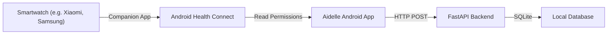

# Aidelle : Your Personal AI Nurse


**Aidelle** is a complete hardware-agnostic health monitoring solution built with an **Android (Jetpack Compose)** mobile client and a **Python FastAPI** backend. It leverages the Android **Health Connect API** to sync seamlessly with smartwatches and wearables, centralizing data on the device before pushing it to the backend for AI-driven health evaluations.

---

##  Architecture Overview



1. **Android App (Aidelle Connect)**: Kotlin and Jetpack Compose mobile app targeting Android 15. Reads data locally through Health Connect.
2. **FastAPI Backend**: Python-based RESTful API that handles data syncing and acts as the brain for Aidelle's AI features.
3. **Database**: Lightweight SQLite instance for storing continuous physiological readings.

---

##  Supported Health Metrics

Aidelle supports modular smart health monitoring sensor data including but not limited to :
* ❤️ **Heart Rate** (`bpm`)
* 👣 **Steps** (`steps`)
* 🩸 **Blood Oxygen / SpO2** (`%`)
* 🛏️ **Sleep Duration** (`minutes`)
* 🌡️ **Body Temperature** (`°C`)

---

##  Project Setup & Installation

### 1. FastAPI Backend setup
```bash
cd fastapi_backend/
python -m venv venv

# On Windows:
.\venv\Scripts\activate
# On Unix or MacOS:
source venv/bin/activate

pip install -r requirements.txt
uvicorn main:app --host 0.0.0.0 --port 8000 --reload
```
*The API will be available at `http://localhost:8000` (Swagger UI at `/docs`).*

### 2. Android App setup
1. Open the `android_app/` directory in **Android Studio**.
2. Sync Project with Gradle Files.
3. Build and run the project onto a Physical Device or Emulator running **API 28+.**
4. Expand the configurable settings panel to input your local API URL.
5. Grant permissions and sync!

---

##  API & Database Documentation

### Entity-Relationship (Database)

The backend SQLite database `health_data.db` relies on the `health_records` table:

| Column Name | Type | Constraints | Description |
| :--- | :--- | :--- | :--- |
| `id` | `INTEGER` | `PRIMARY KEY, AUTOINCREMENT` | Unique record ID |
| `data_type` | `TEXT` | `NOT NULL` | Enumerated string: `heart_rate`, `steps`, etc. |
| `value` | `REAL` | `NOT NULL` | The actual reading (e.g., 98.2) |
| `unit` | `TEXT` | `NOT NULL` | e.g. `bpm`, `%`, `steps` |
| `timestamp` | `TEXT` | `NOT NULL` | ISO 8601 start timestamp of the reading |
| `end_timestamp` | `TEXT` | `NULL` | ISO 8601 end time (for durational data like sleep) |
| `metadata` | `TEXT` | `NULL` | JSON-encoded string for extra flags |
| `device_id` | `TEXT` | `NULL` | Device manufacturer & model identity |
| `created_at` | `TEXT` | `NOT NULL` | Backend insertion timestamp |

### API Endpoints

#### `GET /`
**Health Check Endpoint.**
**Response (`200 OK`)**: 
```json
{
  "status": "online",
  "service": "Aidelle Connect API",
  "total_records": 105,
  "timestamp": "2026-04-18T10:00:00"
}
```

#### `POST /api/health-data`
**Batch upload endpoint for pushing records from mobile client to backend.**
**Payload**: `HealthDataBatch`
```json
{
  "device_id": "samsung SM-G991B",
  "records": [
    {
      "data_type": "heart_rate",
      "value": 75.0,
      "unit": "bpm",
      "timestamp": "2026-04-18T08:30:00Z"
    }
  ]
}
```

#### `GET /api/health-data`
**Query all synced health data with optional query filters.**
**Params:** 
- `data_type` (Optional): Filter to specific biometric.
- `start_time`, `end_time` (Optional ISO 8601 strings)
- `limit` (Default: 100)

#### `GET /api/health-data/latest`
**Fetches the most recent entry for every unique `data_type`. Perfect for rendering dashboards.**

---

## Contact and Credits

Developed by **Mokhtar Ouardi**, **Adam Aburaya** and **Anas Aburaya** for the EarthDay Hackathon.

- **Mokhtar Ouardi**: [GitHub](https://github.com/MokhtarOuardi) | [Email](mailto:m.ouardi@graduate.utm.my)
- **Anas Aburaya**: [GitHub](https://github.com/Shadowpasha) | [Email](mailto:ameranas1923@gmail.com)
- **Adam Aburaya**: [GitHub](https://github.com/adam) | [Email](mailto:@gmail.com)

---
© 2026 InfiniTea Team. All rights reserved.
